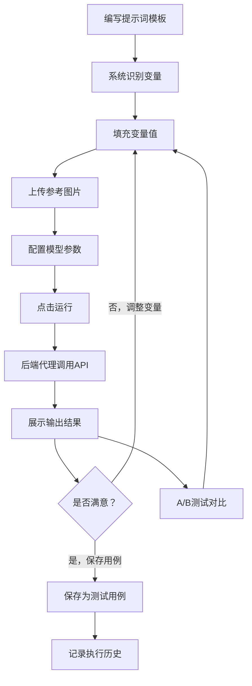

## 1. 产品概述

多模态提示词工程调试平台是一个面向AI开发者和提示词工程师的专业Web工具，用于调试和优化多模态大模型（支持文本+图像输入）的提示词。平台提供可视化双栏编辑器、变量化提示词模板、A/B测试能力以及完整的执行历史追踪，帮助用户系统性地优化多模态提示词效果。

- **目标用户**：AI应用开发者、提示词工程师、多模态模型研究人员
- **核心价值**：将提示词调试从"盲试"转变为"可量化、可对比、可追溯"的系统化流程

## 2. 核心功能

### 2.1 用户角色

| 角色 | 注册方式 | 核心权限 |
|------|----------|----------|
| 默认用户 | 无需注册，直接使用 | 全部功能（单用户本地部署） |

### 2.2 功能模块

1. **提示词编辑器页面**：双栏布局编辑器（左输入右输出）、变量化提示词编辑、图片上传预览、模型参数配置、运行按钮与实时结果展示
2. **测试用例管理页面**：提示词模板列表、变量组合管理、A/B测试对比面板、测试用例收藏与标签
3. **执行历史页面**：历史执行记录列表、输入输出回放、执行耗时与Token统计、搜索与筛选

### 2.3 页面详情

| 页面名称 | 模块名称 | 功能描述 |
|----------|----------|----------|
| 提示词编辑器 | 文本编辑区 | 支持变量语法的富文本编辑器，如[图片描述]、[风格]等变量占位符，自动高亮变量标签 |
| 提示词编辑器 | 图片上传区 | 拖拽/点击上传参考图片，支持多图，缩略图预览，可删除替换 |
| 提示词编辑器 | 变量面板 | 侧边栏展示当前提示词中识别到的变量，提供输入框填充变量值，支持保存变量组合为测试用例 |
| 提示词编辑器 | 模型配置区 | 选择模型、设置温度、最大Token数等参数 |
| 提示词编辑器 | 输出展示区 | 右栏展示模型返回结果，支持Markdown渲染、代码高亮，显示Token用量和耗时 |
| 提示词编辑器 | A/B测试面板 | 横向并排展示两组不同变量组合的运行结果对比 |
| 测试用例管理 | 模板列表 | 展示已保存的提示词模板，支持搜索、标签筛选、复制、删除 |
| 测试用例管理 | 变量组合 | 每个模板下的变量组合列表，快速加载到编辑器 |
| 执行历史 | 历史记录 | 按时间倒序展示所有执行记录，含输入摘要、输出摘要、耗时、Token数 |
| 执行历史 | 详情回放 | 点击记录展开完整输入输出对比视图 |

## 3. 核心流程

用户在编辑器中编写含变量的提示词模板 → 系统自动识别变量标签 → 用户在变量面板中填写变量值 → 点击运行 → 后端代理调用大模型API → 返回结果展示在右栏 → 用户可调整变量值再次运行进行A/B对比 → 保存满意的提示词和变量组合为测试用例 → 在历史记录中回溯任意一次执行

## 4. 用户界面设计

### 4.1 设计风格

- **主色调**：深色系为主（深灰#0F1117背景），搭配青绿色#00D4AA作为强调色，营造专业开发工具氛围
- **辅助色**：琥珀色#F59E0B用于变量高亮，紫蓝色#6366F1用于图片标记
- **按钮风格**：圆角8px，主要按钮实心填充，次要按钮描边，运行按钮带动态发光效果
- **字体**：代码区域使用JetBrains Mono，界面使用Noto Sans SC，标题加粗醒目
- **布局风格**：顶部导航栏 + 主内容区双栏布局，左侧工具面板可折叠
- **图标风格**：线性图标（Lucide），与整体极简科技风一致

### 4.2 页面设计概览

| 页面名称 | 模块名称 | UI元素 |
|----------|----------|--------|
| 提示词编辑器 | 文本编辑区 | 等宽字体、行号、变量标签高亮胶囊、深色背景 |
| 提示词编辑器 | 图片上传区 | 虚线拖拽区域、缩略图网格、悬浮删除按钮 |
| 提示词编辑器 | 变量面板 | 右侧抽屉面板、变量名标签+输入框、保存按钮 |
| 提示词编辑器 | 输出展示区 | Markdown渲染、代码块语法高亮、底部统计条 |
| 提示词编辑器 | A/B测试面板 | 双列并排卡片、差异高亮、统计指标对比 |
| 测试用例管理 | 模板列表 | 卡片网格、标签胶囊、操作按钮组 |
| 执行历史 | 历史记录 | 时间轴布局、可展开卡片、搜索筛选栏 |

### 4.3 响应式设计

- 桌面优先设计，双栏布局在≥1024px宽度下最佳
- 平板端（768-1024px）切换为上下布局
- 移动端（<768px）单栏切换，通过Tab切换输入/输出
