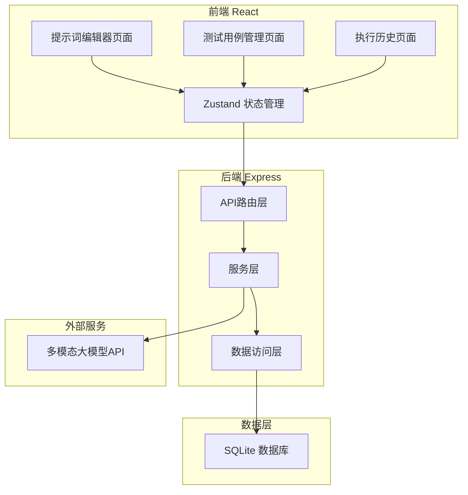
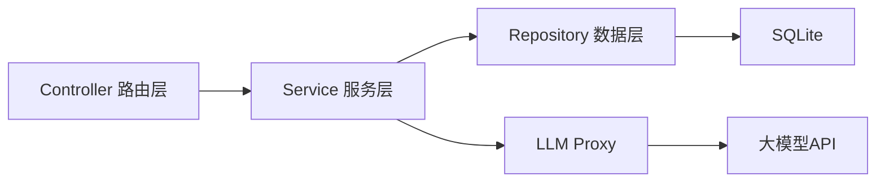
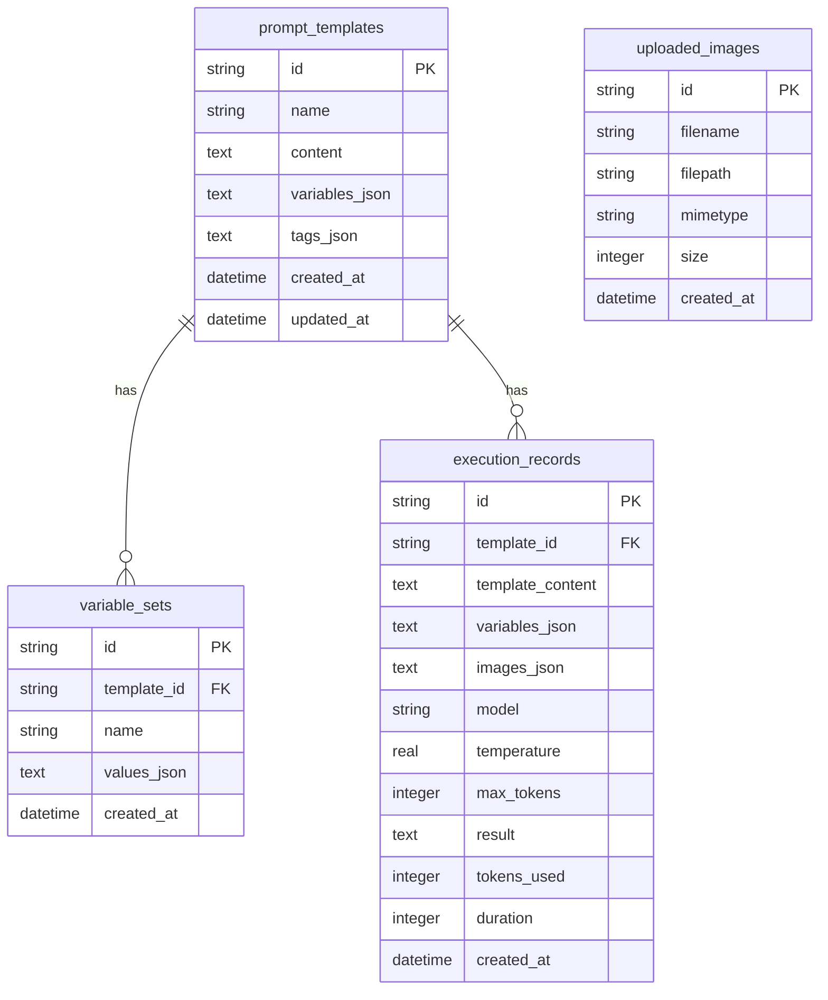

## 1. 架构设计



## 2. 技术说明

- **前端**：React@18 + TypeScript + Tailwind CSS@3 + Vite
- **初始化工具**：vite-init (react-express-ts 模板)
- **状态管理**：Zustand
- **后端**：Express@4 + TypeScript (ESM)
- **数据库**：SQLite (better-sqlite3)
- **图标库**：lucide-react

## 3. 路由定义

| 路由 | 用途 |
|------|------|
| / | 提示词编辑器主页面（双栏编辑+运行+结果展示） |
| /cases | 测试用例管理页面（模板与变量组合管理） |
| /history | 执行历史页面（历史记录浏览与回放） |

## 4. API定义

### 4.1 提示词执行

```typescript
interface ExecutePromptRequest {
  template: string
  variables: Record<string, string>
  images: string[]
  model: string
  temperature: number
  maxTokens: number
}

interface ExecutePromptResponse {
  id: string
  result: string
  tokensUsed: number
  duration: number
  timestamp: string
}
```

POST /api/execute — 执行提示词，调用大模型API返回结果

### 4.2 测试用例

```typescript
interface PromptTemplate {
  id: string
  name: string
  content: string
  variables: string[]
  tags: string[]
  createdAt: string
  updatedAt: string
}

interface VariableSet {
  id: string
  templateId: string
  name: string
  values: Record<string, string>
  createdAt: string
}
```

GET /api/templates — 获取所有提示词模板
POST /api/templates — 创建提示词模板
PUT /api/templates/:id — 更新提示词模板
DELETE /api/templates/:id — 删除提示词模板
GET /api/templates/:id/variable-sets — 获取模板的变量组合
POST /api/templates/:id/variable-sets — 创建变量组合
DELETE /api/variable-sets/:id — 删除变量组合

### 4.3 执行历史

```typescript
interface ExecutionRecord {
  id: string
  templateId: string | null
  templateContent: string
  variables: Record<string, string>
  images: string[]
  model: string
  temperature: number
  maxTokens: number
  result: string
  tokensUsed: number
  duration: number
  createdAt: string
}
```

GET /api/history — 获取执行历史列表（支持分页、搜索）
GET /api/history/:id — 获取单条执行记录详情

### 4.4 图片上传

POST /api/upload — 上传图片，返回图片ID和访问路径

## 5. 服务端架构图



## 6. 数据模型

### 6.1 数据模型定义



### 6.2 数据定义语言

```sql
CREATE TABLE prompt_templates (
    id TEXT PRIMARY KEY,
    name TEXT NOT NULL,
    content TEXT NOT NULL,
    variables_json TEXT DEFAULT '[]',
    tags_json TEXT DEFAULT '[]',
    created_at DATETIME DEFAULT CURRENT_TIMESTAMP,
    updated_at DATETIME DEFAULT CURRENT_TIMESTAMP
);

CREATE TABLE variable_sets (
    id TEXT PRIMARY KEY,
    template_id TEXT NOT NULL,
    name TEXT NOT NULL,
    values_json TEXT DEFAULT '{}',
    created_at DATETIME DEFAULT CURRENT_TIMESTAMP,
    FOREIGN KEY (template_id) REFERENCES prompt_templates(id) ON DELETE CASCADE
);

CREATE TABLE execution_records (
    id TEXT PRIMARY KEY,
    template_id TEXT,
    template_content TEXT NOT NULL,
    variables_json TEXT DEFAULT '{}',
    images_json TEXT DEFAULT '[]',
    model TEXT NOT NULL,
    temperature REAL DEFAULT 0.7,
    max_tokens INTEGER DEFAULT 2048,
    result TEXT NOT NULL,
    tokens_used INTEGER DEFAULT 0,
    duration INTEGER DEFAULT 0,
    created_at DATETIME DEFAULT CURRENT_TIMESTAMP,
    FOREIGN KEY (template_id) REFERENCES prompt_templates(id) ON DELETE SET NULL
);

CREATE TABLE uploaded_images (
    id TEXT PRIMARY KEY,
    filename TEXT NOT NULL,
    filepath TEXT NOT NULL,
    mimetype TEXT NOT NULL,
    size INTEGER DEFAULT 0,
    created_at DATETIME DEFAULT CURRENT_TIMESTAMP
);

CREATE INDEX idx_variable_sets_template ON variable_sets(template_id);
CREATE INDEX idx_execution_records_template ON execution_records(template_id);
CREATE INDEX idx_execution_records_created ON execution_records(created_at DESC);
```
